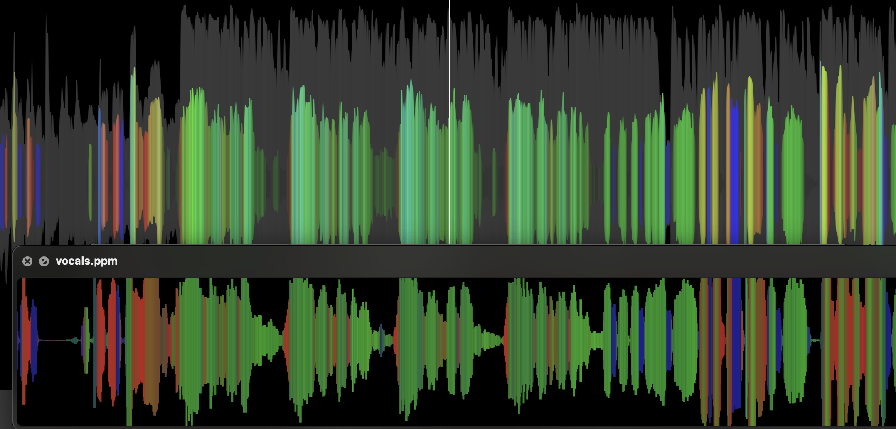
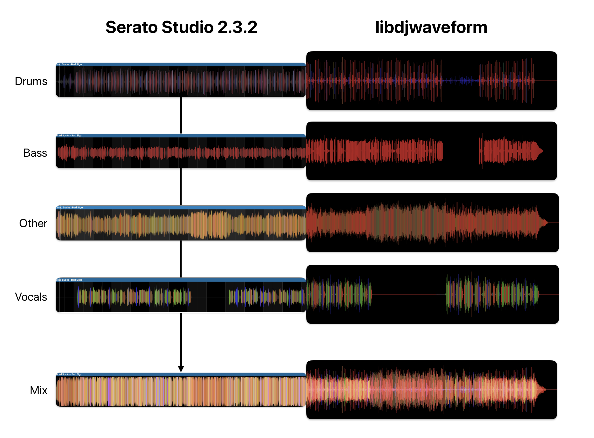

# DJ Waveform Library

> [!CAUTION]
> This code is unmaintained, as it was just an intermediate experiment. It *works on my machine*®, but there are likely several edge case bugs, and the streaming implementation is not well-tested. Do not rely on this code. 
> 
> Or do, I'm a Markdown file, not a cop.

<hr>

A library for generating a Serato-style **color-coded waveform** from audio data. It supports **non-streaming** (file in → file out) and **streaming** (incrementally feeding audio) modes, plus a variety of configurable analysis parameters. Offline image generation is fast, a 25000x3000 waveform render for a ~3 minute song will take less than 500ms.

The library uses **Short-Time Fourier Transform (STFT)** to estimate frequency content and a user-defined **frequency → color** gradient to color each time-slice based on its spectral energy. The result is a horizontally oriented visualization with amplitude on the vertical axis and color representing dominant frequencies. The example gradient is meant to be similar to Serato Sample/DJ/Studio.

## Features

- **Audio Input**:
  - Uses [libsndfile](http://www.mega-nerd.com/libsndfile/) for reading WAV (and other formats).  
  - Supports 1 or 2 channels (mono or stereo).  
  - Accepts 16-, 24-, 32-bit integer or float audio internally converted to float.  
- **Flexible Sample Rate Support**: 
  - Checks for standard rates (11 025, 22 050, 44.1 k, 48 k, 96 k, 192 k Hz).  
- **STFT Analysis**:
  - Configurable `fftSize` (e.g., 2048 samples).  
  - Configurable `overlapFactor` (e.g., 2 => 50% overlap of sample chunks).  
  - Choice of window function (Hann (default), Hamming, Blackman, or none).  
- **Partial-Range**:
  - Option to process the entire file or only a specific range, supplied in samples or milliseconds.  
- **Color Gradient**:
  - Arbitrarily large set of frequency→color control points, interpolated for in-between frequencies.  
- **Streaming API**:
  - Incremental "ring-buffer" approach to feed audio in small chunks.  
  - Generates columns as each analysis window is filled.  
  - The columns are internally stored and "resampled" horizontally to match the user’s final requested width.  
- **Multithreading** (in non-streaming mode):
  - Uses [FFTW3](http://www.fftw.org/) with OpenMP to speed up column computations.

## LICENSE

All code is dedicated to the public domain.

The demo song *Bad Sign* by *Brad Sucks* is licensed under a Attribution-ShareAlike 3.0 International License. This also applies to the derivatives (stems) included as examples in this project.

## Considerations

⚠️⚠️⚠️ Full mix processing is not useful and will not look like Serato waveforms. ⚠️⚠️⚠️

Instead:

* run **stem separation** into: bass, vocals, other/harmonic, drums, using e.g. `demucs`
* generate waveforms
* blend all four images

Here's an example comparing waveforms generated by Serato Studio and this library for the vocal stem. Differences in amplitude are due to different stem separation models used.



To use this library, you **must** bring your own gradient, or copy the Serato-like default from the example code.

A good blending strategy is screen compositing, which (IMO) gives a much better visual part separation in the full mix compared to other tools. The final blend is an image-magick eval sequence of `-compose screen -composite` in the order of Drums -> Vocals -> Other -> Bass.



One downside of the current implementation: we only draw a mirrored column-graph, not an anti-aliased interpolated (smooth) waveform like Serato.

<details>

<summary>Reproduce this result</summary>

```bash
# split stems using Dmucs 4 HT fine-tuned or use the prepared assets:
./waveform assets/Bad\ Signs\ Stems/target_2_other.wav assets/other.ppm 2500 300
./waveform assets/Bad\ Signs\ Stems/target_0_drums.wav assets/drums.ppm 2500 300
./waveform assets/Bad\ Signs\ Stems/target_1_bass.wav assets/bass.ppm 2500 300
./waveform assets/Bad\ Signs\ Stems/target_3_vocals.wav assets/vocals.ppm 2500 300

convert other.ppm other.png
convert drums.ppm drums.png
convert bass.ppm bass.png
convert vocals.ppm vocals.png

convert drums.png vocals.png -compose screen -composite combined.png
convert combined.png other.png -compose screen -composite combined.png
convert combined.png bass.png -compose screen -composite combined.png
```
</details>


## Example CLI use

The provided example is not a complete CLI tool. It's only included for illustration purposes.

On macOS (no other platforms tested):

```bash
brew install llvm libomp fftw libsndfile
```

* You may need to install fftw from source.
* OpenMP requires upstream LLVM

Compile the example

```bash
/opt/homebrew/opt/llvm/bin/clang \
  -O3 \
  -o waveform \
  main.c djwaveform.c \
  $(pkg-config --cflags fftw3f) \ 
  $(pkg-config --cflags sndfile) \ 
  $(pkg-config --libs sndfile) \ 
  $(pkg-config --libs fftw3f) \
  -lm \
  -fopenmp
```

Then:

```bash
./waveform target_3_vocals.wav vocals.ppm 25000 3000
```

## API Use

### Offline

###### `djw_generate_waveform_file(input.wav, output.ppm, &cfg)`

Reads the entire audio file, creates the waveform image, and writes a PPM file.

###### `djw_generate_waveform_memory(samples, numChannels, numFrames, handle, outRGB)`

If you already have audio samples in memory (as floats), this function directly generates the final RGB buffer of size `(width * height * 3)`.

### Streaming

###### `djw_stream_begin(handle, numChannels, sampleRate, totalFrames)`

Prepare ring buffers and internal state. If totalFrames is unknown, pass `-1`.

###### `djw_stream_push_frames(handle, frames, nFrames)`

Provide blocks of float audio data. The library accumulates columns whenever it has enough samples for the next hop.

###### `djw_stream_end(handle, outRGB)`

Finalize partial windows, resample the columns to the final width, and write `(width * height * 3)` RGB data into `outRGB`.

## Analysis Approach & Parameter Choices

### STFT and the FFT

* This library uses Short-Time Fourier Transform (STFT). Essentially, the audio is split into frames of size `fftSize`, and each frame is transformed by an FFT.
* By examining frequency bins over short time windows, we can estimate the "frequency content" at each moment in time. This content is then colorized in the resulting waveform.
* Typical `fftSize` values are `1024` or `2048`. Larger sizes give better frequency resolution but may be slower and blur time detail.

### Overlap Factor

* If you choose `overlapFactor = 2`, it means 50% overlap. This improves time resolution because consecutive FFT windows share half of their samples. 
* Larger overlaps (e.g., factor of `4 => 75%`) give even finer time detail but require more computation.

### Window Function

Real signals are finite in length—and the window we analyze is "cut out" from a continuous signal. Thus the transition at the segment’s boundaries can artificially spread the frequency content into nearby FFT bins. This "leakage" means the spectral peaks are wider and energy can appear in bins that do not exactly match the true signal frequencies.

Window functions (Hann, Hamming, Blackman, etc.) are used to reduce this leakage. By smoothly tapering the amplitude of the signal toward zero at the edges of each FFT frame, these windows reduce sharp discontinuities at the boundaries—and in turn, minimize energy "leaking" into adjacent bins.

You can disable windowing by selecting `none`.

## Color Mapping

A user-defined array of `DJW_FreqColorPoint` (frequency → R,G,B) forms a gradient. The library linearly interpolates between adjacent control points to color each column. Think of each gradient control point as a phase transition between the "energy content" of the audio section. 

This allows users to quickly identify instruments, grooves, sections, and repeating patterns in musical content. You can create custom gradients for other purposes (audio forensics, transcriptions, further processing, etc.).

* Use a broad frequency range from very low (~10 Hz) to beyond your sample’s typical max frequency (e.g., 10 kHz+).
* Logarithmic frequency mapping (`useLogFreq = 1`) can highlight mid/high frequencies more distinctly. Not recommended for stems.

## Partial Range Selection

The configuration supports `DJW_RANGE_FULL`, `DJW_RANGE_SAMPLES`, or `DJW_RANGE_MS`:

* FULL: Use the entire file.
* SAMPLES: The library only processes `[rangeStart..rangeEnd]` sample indices.
* MS: The library converts your `[rangeStart..rangeEnd]` in milliseconds to sample indices.

## Choosing Mono vs. Stack

* `DJW_MULTI_MIXDOWN`: Averages all channels into one waveform. Simpler.
* `DJW_MULTI_STACK`: Each channel’s amplitude is drawn in a separate vertical band. For 2 channels, the top half of the image corresponds to channel 0 and the bottom half to channel 1.
  * choose this if wildly different spectral content is present on each channel (e.g. due to LCR mixing of instruments with different timbres)

## When to Use Streaming Mode

Use streaming if:

* You do not want to load the entire file at once (large files, real-time scenarios).
* You want to feed data incrementally from a network stream or a live audio input.

Use non-streaming if:

* You are comfortable loading an entire audio file into memory.
* You want a straightforward "one-shot" function call with fewer moving parts.

<hr>

<sub>Note: Serato is a trademark and not affiliated in any way with this project.</sub>